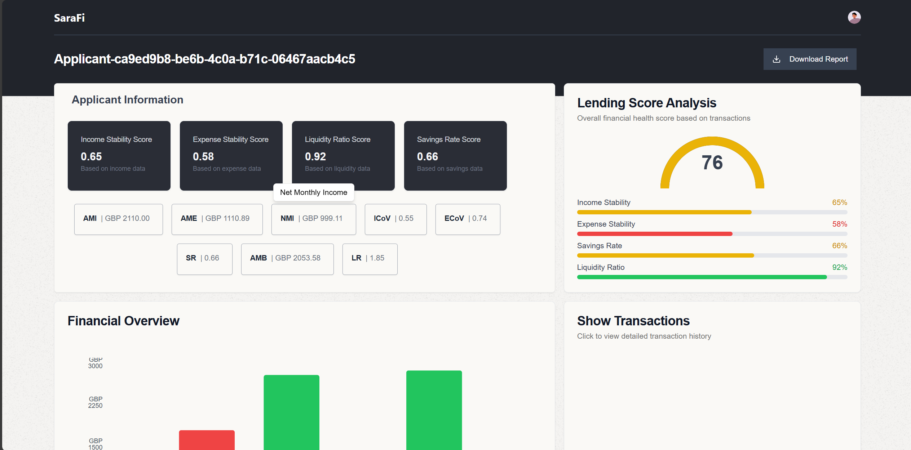
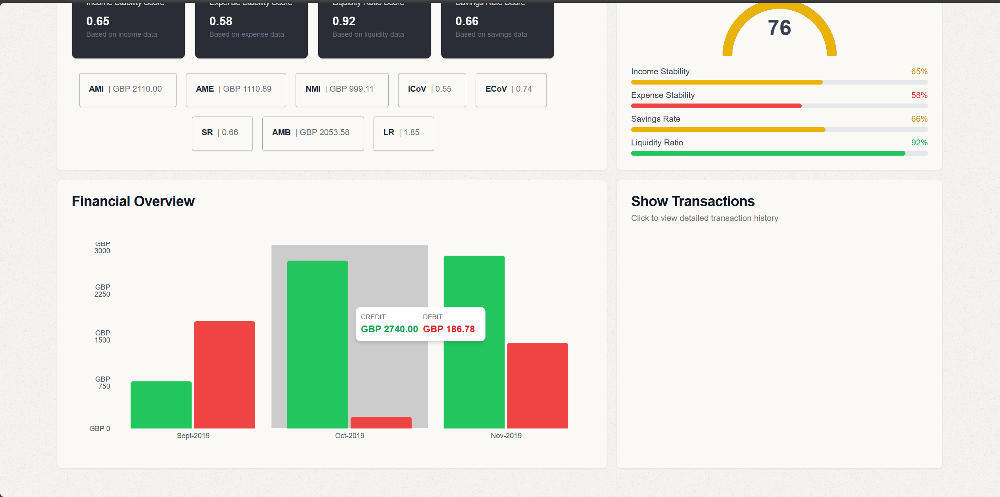
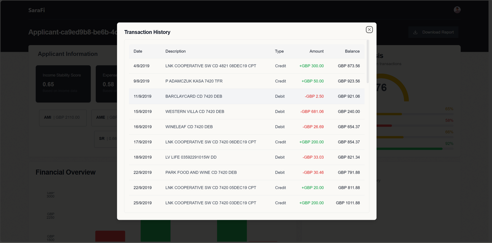
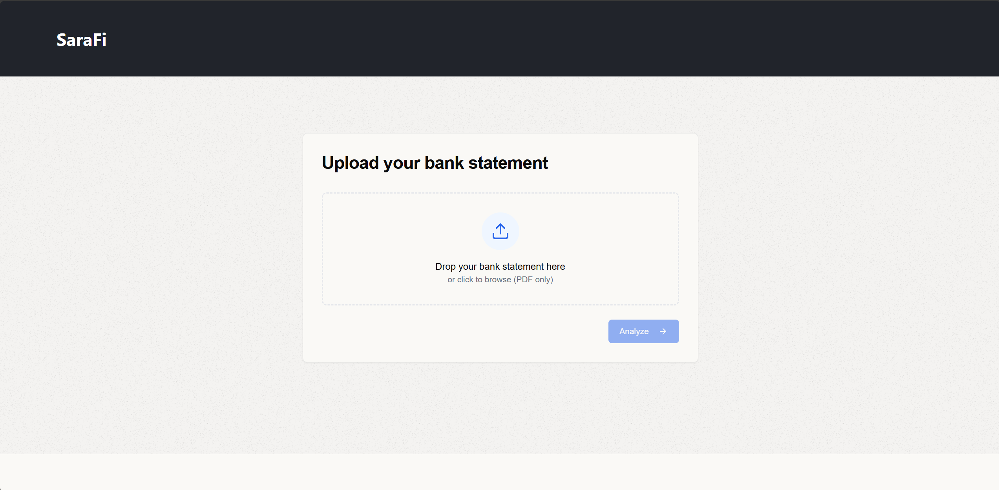

# GenAI Bank Statement Loan Evaluator

This is a take home assignment for a startup, where I had 14 days to solve a real-world engineering problem. 
### 𝐓𝐡𝐞 𝐭𝐚𝐬𝐤? 
Given an applicant's bank statement, decide whether a loan should be approved. 
### 𝐓𝐡𝐞 𝐜𝐚𝐭𝐜𝐡? 
The currency could vary, and bank statements come in different formats, making it an open-ended problem with endless solutions.

### Screenshots

**Main Dashboard**  

**Month-over-Month Income Expense Graph**  

**Extracted Transactions**  

**Bank Statement Upload Page**  

I decided to tackle this by mimicking how a bank analyst would traditionally assess a loan based purely on the bank statement (while acknowledging that there are other factors at play). My approach involved extracting transactions from the bank statements and creating a mathematical model to generate a final lending score with weights. This model relied on 𝐤𝐞𝐲 𝐟𝐢𝐧𝐚𝐧𝐜𝐢𝐚𝐥 𝐢𝐧𝐝𝐢𝐜𝐚𝐭𝐨𝐫𝐬 (𝐊𝐅𝐈𝐬) such as Net Monthly Income, Liquidity Score, and 𝐝𝐢𝐦𝐞𝐧𝐬𝐢𝐨𝐧𝐥𝐞𝐬𝐬 quantities like Income Coefficient of Variation and Expense Coefficient of Variation to account for currency variations.

I then visualized this data in a user-friendly UI, presenting key insights in a clear way for an analyst to easily review.

It was a fun and intriguing challenge, showcasing how 𝐆𝐞𝐧𝐀𝐈 can reshape niche areas within finance.

### Tech Stack
- FastAPI
- MongoDB
- NextJs
- Groq
